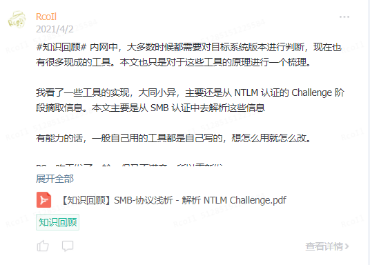
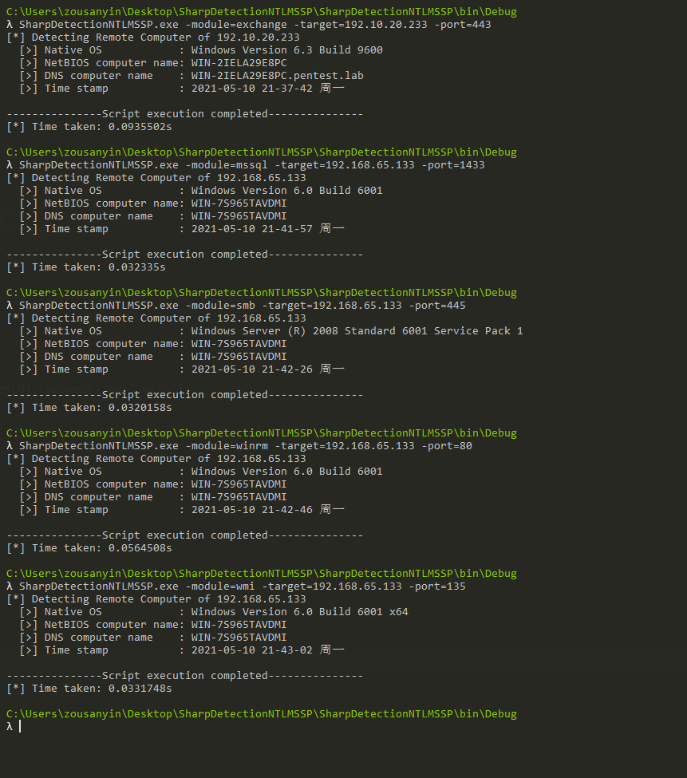

# SharpDetectionNTLMSSP

https://mp.weixin.qq.com/s/Yr71bBrLDFjbDHkBqZ_HPg

### 0x00 前言

在前端时间，基于 SMB 中的 NTLMSSP 数据包做了一个解析工具。



而在昨天看到了有个公众号发的一篇文章 [红蓝对抗之利用NTLM认证探测Windows信息](https://mp.weixin.qq.com/s/yBFGrb9D8nmO0KLGjYds8g)，总结得挺多种方式的。因此在参考了其代码后，综合之前写的代码，最后写成了这个工具


### 0x01 实现

- SMB 的数据包是延用了之前写的工具生成的；
- WMI 是从其他工具提取发送的数据包，包含判断机器位数 ；

- MSSQL 是从 [MssqlInfo](https://github.com/FeigongSec/NTLMINFO/blob/main/MssqlInfo/MssqlInfo/Program.cs#L29-L68) 截取的；
- Exchange、WinRM 基于 HTTP 的认证。

关于 NTLMSSP 的内容，这里使用了结构体进行解析，比较容易理解。

有问题提 Issues...

### 0x02 使用方法

```
SharpDetectionNTLMSSP.exe -module=smb -target=192.168.65.133 -port=445 -threads=15

Required Flags:
	-target: The IP address of the target. the following formats are supported
				192.168.65.133
				192.168.65.133,192.168.65.123
				192.168.65.0/24
				192.168.65.0/16
				192.168.65.0/8
				192.168.65.55-192.168.70.233
				target.txt
	-module: The service module of the target. the following modules are supported
				exchange
				mssql
				smb
				winrm
				wmi
	-port: The corresponding port of the target's service module

Optional Flags:
	-threads: Threads to use to concurently enumerate multiple remote hosts (Default: 15)
```

效果：



### 0x03 参考

[红蓝对抗之利用NTLM认证探测Windows信息](https://mp.weixin.qq.com/s/yBFGrb9D8nmO0KLGjYds8g)

[MssqlInfo](https://github.com/FeigongSec/NTLMINFO/blob/main/MssqlInfo/MssqlInfo/Program.cs#L29-L68)

[SharpSecDump](https://github.com/G0ldenGunSec/SharpSecDump/blob/master/SharpSecDump/Program.cs#L18-L92)