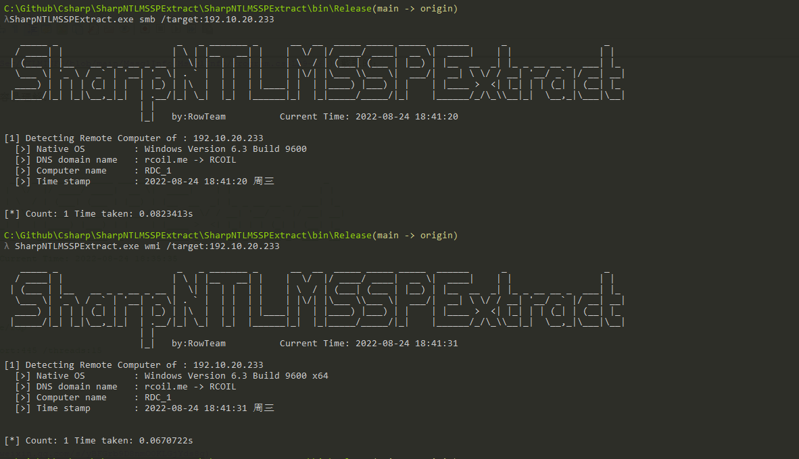

# SharpNTLMSSPExtract

由 SharpDetectionNTLMSSP 改名为 SharpNTLMSSPExtract

https://mp.weixin.qq.com/s/Yr71bBrLDFjbDHkBqZ_HPg

### 0x00 前言

在前端时间，基于 SMB 中的 NTLMSSP 数据包做了一个解析工具。


而在昨天看到了有个公众号发的一篇文章 [红蓝对抗之利用NTLM认证探测Windows信息](https://mp.weixin.qq.com/s/yBFGrb9D8nmO0KLGjYds8g)，总结得挺多种方式的。因此在参考了其代码后，综合之前写的代码，最后写成了这个工具


### 0x01 实现

- SMB 的数据包是延用了之前写的工具生成的；
- WMI 是从其他工具提取发送的数据包，包含判断机器位数 ；

- MSSQL 是从 [MssqlInfo](https://github.com/FeigongSec/NTLMINFO/blob/main/MssqlInfo/MssqlInfo/Program.cs#L29-L68) 截取的；
- Exchange、WinRM 基于 HTTP 的认证。

关于 NTLMSSP 的内容，这里使用了结构体进行解析，比较容易理解。

有问题提 Issues...

### 0x02 使用方法

```
   _____ _                      _   _ _______ _      __  __  _____ _____ _____  ______      _                  _
  / ____| |                    | \ | |__   __| |    |  \/  |/ ____/ ____|  __ \|  ____|    | |                | |
 | (___ | |__   __ _ _ __ _ __ |  \| |  | |  | |    | \  / | (___| (___ | |__) | |__  __  _| |_ _ __ __ _  ___| |_
  \___ \| '_ \ / _` | '__| '_ \| . ` |  | |  | |    | |\/| |\___ \\___ \|  ___/|  __| \ \/ / __| '__/ _` |/ __| __|
  ____) | | | | (_| | |  | |_) | |\  |  | |  | |____| |  | |____) |___) | |    | |____ >  <| |_| | | (_| | (__| |_
 |_____/|_| |_|\__,_|_|  | .__/|_| \_|  |_|  |______|_|  |_|_____/_____/|_|    |______/_/\_\\__|_|  \__,_|\___|\__|
                         | |
                         |_|   by:RowTeam          Current Time: 2022-08-24 18:35:35


### Command Line Usage ###

    SharpNTLMSSPExtract smb/wmi/winrm/mssql/exchange/rdp

SharpNTLMSSPExtract.exe smb /target:10.0.100.233 /port:445 /threads:15
```

效果：



### 0x03 参考

[红蓝对抗之利用NTLM认证探测Windows信息](https://mp.weixin.qq.com/s/yBFGrb9D8nmO0KLGjYds8g)

[MssqlInfo](https://github.com/FeigongSec/NTLMINFO/blob/main/MssqlInfo/MssqlInfo/Program.cs#L29-L68)

[SharpSecDump](https://github.com/G0ldenGunSec/SharpSecDump/blob/master/SharpSecDump/Program.cs#L18-L92)